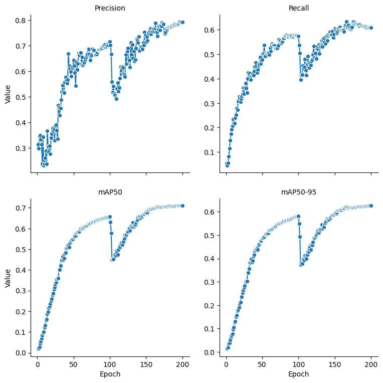
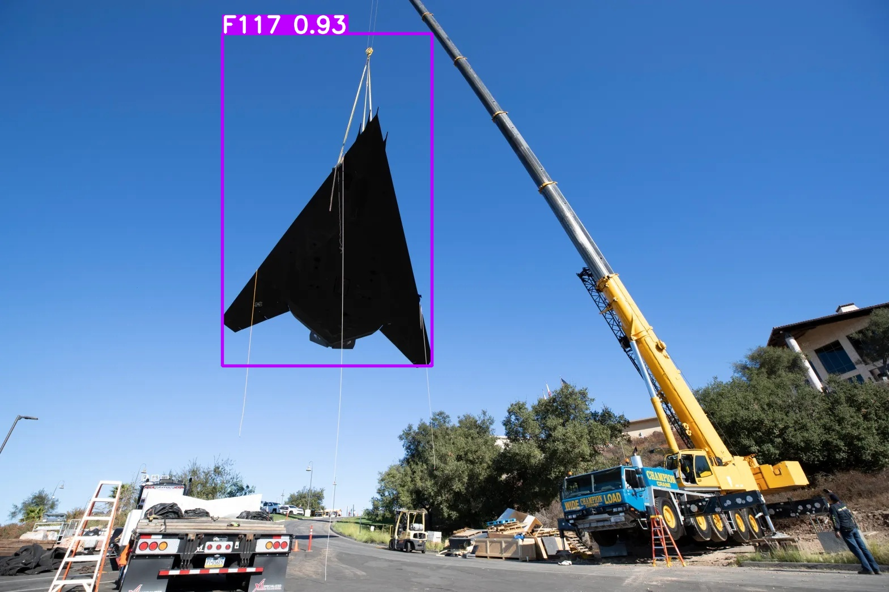
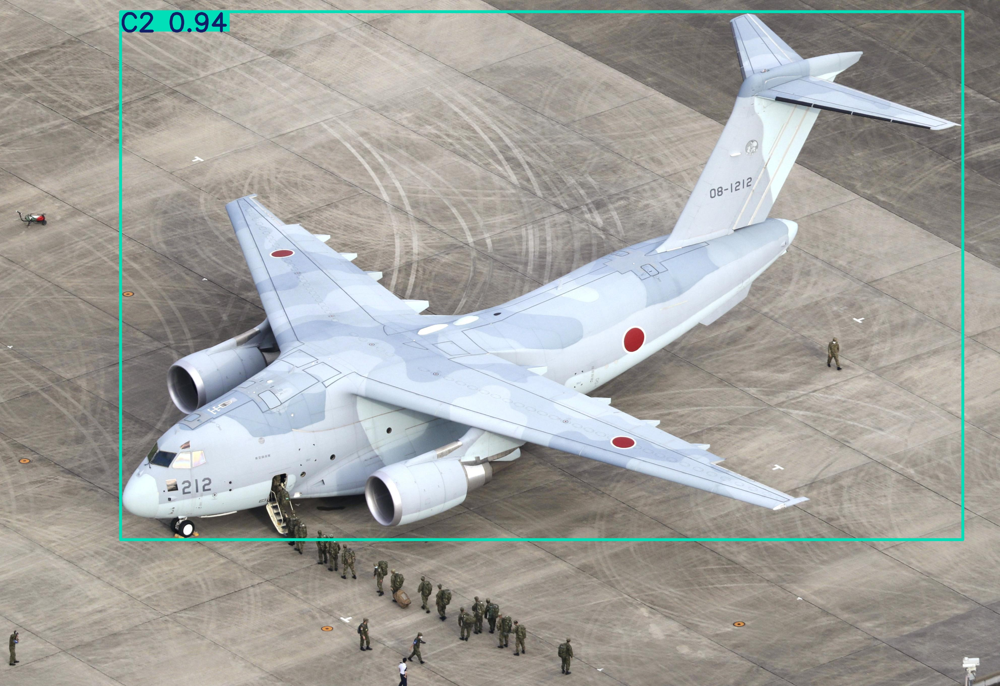
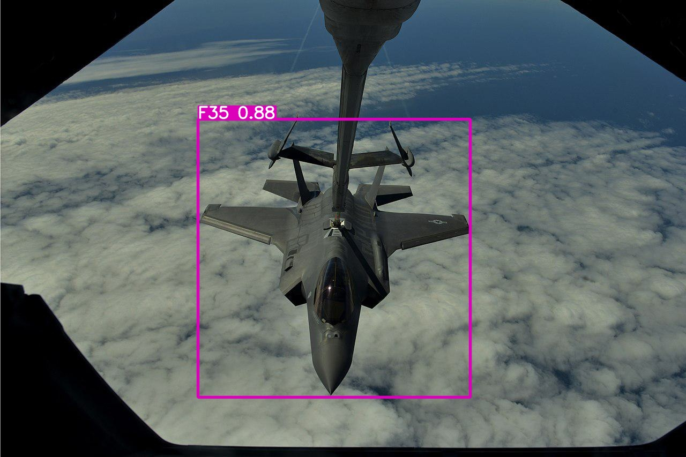
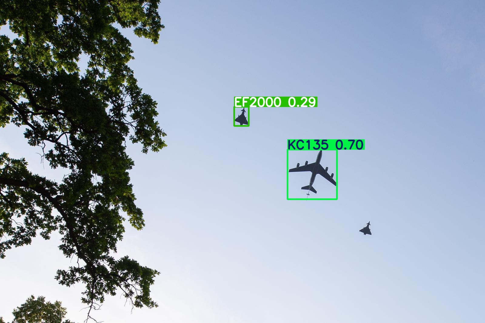
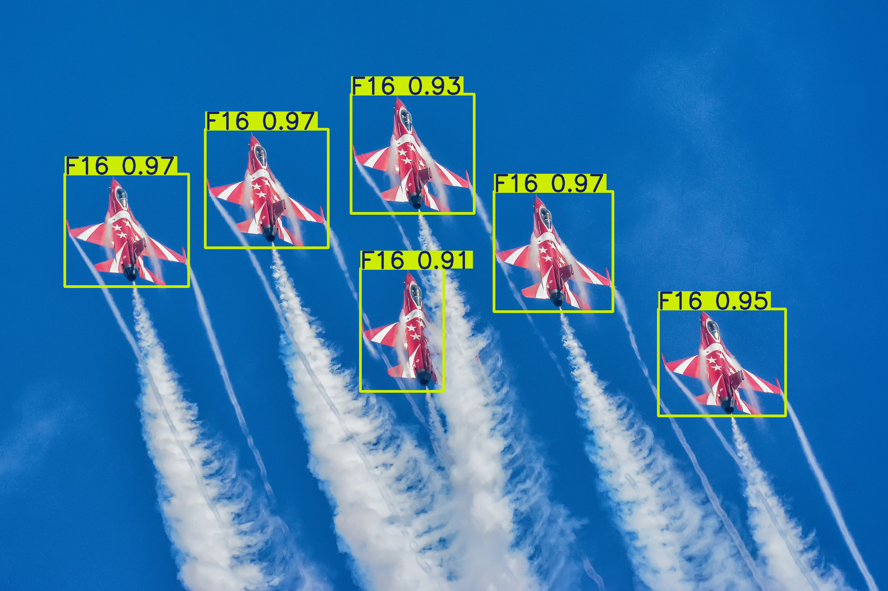
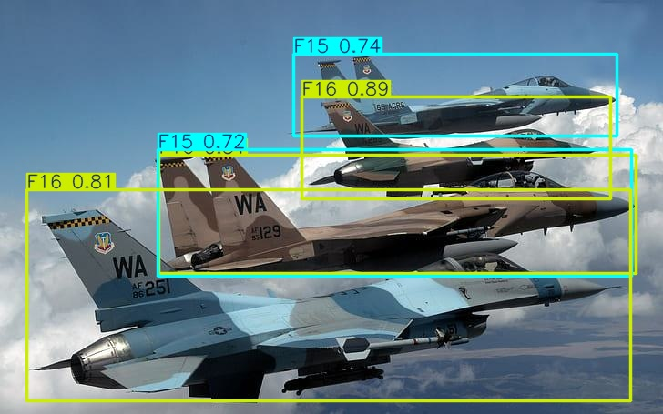
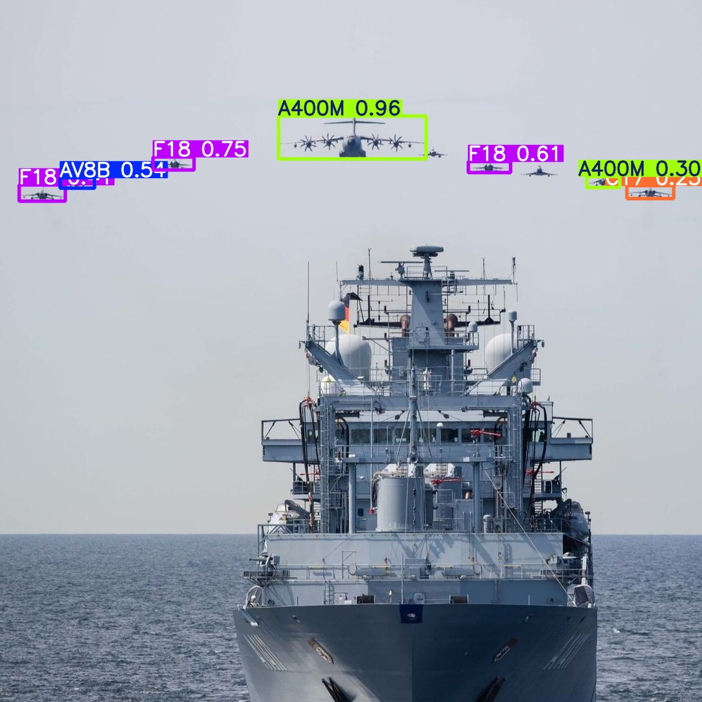
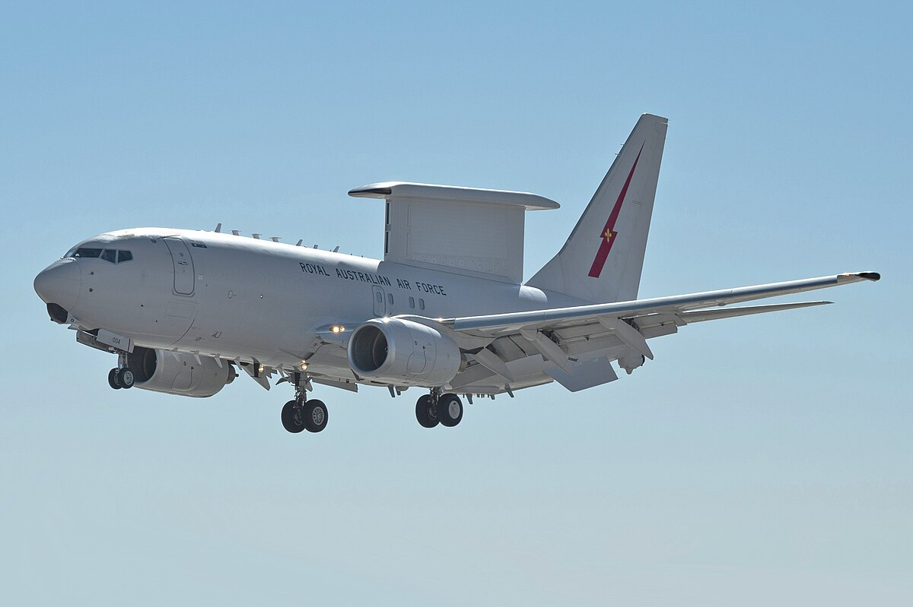

# Military Aircraft Detection with YOLOv11

A deep learning project that uses YOLOv11 (You Only Look Once version 11) to detect and classify military aircraft across different lighting conditions, angles, and scenarios. The model is trained on a dataset of 64 different types of aircraft, including fighters, bombers, stealth planes, and helicopters from various countries.

## Overview

Military aircraft detection is a field of significant relevance to national security, with applications in military intelligence gathering, the development of offensive and defensive strategies, and rapid response initiatives. This project addresses the challenges of detecting aircraft in images captured under various lighting conditions and across a wide range of scenarios.

The project employs:
- **YOLOv11** for real-time object detection
- **Dataset preprocessing** to convert annotations to YOLO format
- **Two-phase training** (100 + 100 epochs) for optimal performance
- **Comprehensive evaluation** using mAP@50 and mAP@50-95 metrics

## Motivation

Aircraft detection plays a critical role in enabling tools for rapid decision-making across various domains, including military intelligence gathering, air traffic management, and automated navigation systems. Despite its potential, numerous challenges remain, particularly in relation to the quality of input data used for detection.

Satellite imagery, a common data source for aircraft detection, often suffers from extremely low resolution, which can obscure important features and hinder accurate detection. Moreover, environmental factors such as cloud cover, varying lighting conditions, and complex backgrounds further complicate the classification process.

In the specific context of military aircraft, their roles are diverse and strategically significant, encompassing offensive operations, defensive measures, and support for ground-based missions. Accurate detection is essential not only for enhancing situational awareness and enabling timely decision-making but also for ensuring the effectiveness of defensive and offensive strategies in modern military operations.

## Dataset

The dataset contains 17,733 images and a total of 30,959 military aircraft instances, spanning 64 classes of aerial vehicles. Each entry in the dataset corresponds to a detected aircraft and includes:

- Filename
- Image resolution (width and height)
- Aircraft class
- Bounding box coordinates (xmin, ymin, xmax, ymax)

**Top 5 Most Common Aircraft:**
- F16: 1,674 instances (5.4%)
- F18: 1,559 instances (5.0%)
- F15: 1,434 instances (4.6%)
- F35: 1,294 instances (4.2%)
- C130: 1,277 instances (4.1%)

United States fighter aircraft (identified by the prefix "F-") collectively account for 19.25% of all detections.

**Dataset Split:**
- Training: 90% (13,748 images)
- Validation: 10% (1,564 images)

The dataset underwent preprocessing to prepare the data for the YOLO model format. This process involved creating a `.yaml` file specifying paths to training and validation folders, each containing two subfolders: one for images and another for labels. Labels consist of separate `.txt` files for each image, containing the class and bounding box coordinates in normalized format.

## Installation

### Prerequisites

- Python 3.7+
- CUDA-capable GPU (recommended)
- pip or conda

### Setup

1. Clone the repository:
```bash
git clone <repository-url>
cd <repository-name>
```

2. Install required packages:
```bash
pip install ultralytics torch torchvision pandas numpy matplotlib seaborn tqdm
```

Or using conda:
```bash
conda install pytorch torchvision -c pytorch
pip install ultralytics pandas numpy matplotlib seaborn tqdm
```

## Project Structure

```
.
├── data/
│   ├── dataset/              # CSV files with annotations
│   ├── images/               # Training images
│   ├── labels/               # YOLO format labels
│   ├── val_images/           # Validation images
│   └── mydata.yaml           # YOLO dataset configuration
├── EDA.ipynb                 # Exploratory Data Analysis
├── training.ipynb            # YOLOv11 model training
├── image_classification.ipynb # Inference on validation images
├── extract_metrics.ipynb     # Training metrics extraction and visualization
├── imgs/                     # Project images
│   ├── plots.png             # Training metrics over epochs
│   ├── 1.jpg - 8.jpg         # Detection examples
│   ├── rafale.jpg            # Rafale fighter example
│   ├── e7.jpg                # Boeing E-7 example
│   ├── z19.jpg               # Harbin Z-19 example
│   ├── yf23.jpg              # Northrop YF-23 example
│   ├── jf17.jpg              # JF-17 Thunder example
│   ├── j10.jpg               # Chengdu J-10 example
│   └── an225.jpg             # Antonov An-225 example
└── README.md                 # This file
```

## Usage

### Step 1: Exploratory Data Analysis

Open `EDA.ipynb` to:
- Load and explore the dataset from CSV files
- Analyze class distribution
- Identify the most common aircraft types
- Understand dataset statistics (17,733 images, 30,959 instances, 64 classes)

### Step 2: Model Training

Open `training.ipynb` to train the YOLOv11 model:

1. **Initial Training (100 epochs):**
```python
from ultralytics import YOLO

model = YOLO("yolo11n.pt")
results = model.train(
    data="data/mydata.yaml",
    epochs=100,
    imgsz=640,
    device=0  # GPU device
)
model.save('milplanes.pt')
```

2. **Additional Training (100 epochs):**
```python
model = YOLO("milplanes.pt")
results = model.train(
    data="data/mydata.yaml",
    epochs=100,
    imgsz=640,
    device=0
)
model.save('milplanes_200.pt')
```

**Training Configuration:**
- Model: YOLOv11n (nano variant)
- Image size: 640x640
- Batch size: 16
- Optimizer: SGD (auto-selected)
- Learning rate: 0.01
- Data augmentation: Enabled (mosaic, random scaling, flipping, etc.)

### Step 3: Metrics Extraction

Open `extract_metrics.ipynb` to:
- Extract training metrics from log files
- Visualize Precision, Recall, mAP@50, and mAP@50-95 over epochs
- Generate plots showing training progress across both training phases

### Step 4: Inference and Evaluation

Open `image_classification.ipynb` to:
- Load the trained model
- Run inference on validation images
- Generate detection results with bounding boxes and class predictions

Example inference:
```python
model = YOLO("milplanes_200.pt")
results = model([
    "data/val_images/1.jpg",
    "data/val_images/2.jpg",
    # ... more images
], save=True)
```

## Results

### Overall Performance

The model achieved the following metrics after 200 epochs of training:

- **Average Precision**: 0.792
- **Recall**: 0.609
- **mAP@50**: 0.71
- **mAP@50-95**: 0.626

### Top 10 Performing Classes

| Class | Images | Instances | Precision | Recall | mAP50 | mAP50-95 |
|-------|--------|-----------|-----------|--------|-------|----------|
| Z19   | 3      | 3         | 1.000     | 0.572  | 0.995 | 0.830    |
| E7    | 19     | 19        | 0.897     | 1.000  | 0.990 | 0.911    |
| YF23  | 9      | 9         | 0.817     | 0.778  | 0.931 | 0.916    |
| Ka52  | 11     | 17        | 1.000     | 0.872  | 0.922 | 0.897    |
| Ka27  | 6      | 6         | 0.703     | 0.833  | 0.909 | 0.851    |
| C2    | 62     | 80        | 0.955     | 0.794  | 0.905 | 0.861    |
| P3    | 24     | 66        | 0.894     | 0.727  | 0.899 | 0.707    |
| TB2   | 10     | 77        | 0.916     | 0.844  | 0.892 | 0.578    |
| US2   | 58     | 67        | 0.865     | 0.763  | 0.865 | 0.750    |
| AG600 | 23     | 23        | 0.875     | 0.783  | 0.858 | 0.813    |

The top-performing classes consisted of easily identifiable aircraft with distinctive characteristics, such as the Harbin Z-19 helicopter, Boeing E-7 Wedgetail cargo plane, and Northrop YF-23 fighter jet.

### Bottom 10 Performing Classes

| Class | Images | Instances | Precision | Recall | mAP50 | mAP50-95 |
|-------|--------|-----------|-----------|--------|-------|----------|
| CL415 | 14     | 17        | 0.925     | 0.412  | 0.553 | 0.494    |
| An72  | 15     | 27        | 0.734     | 0.511  | 0.510 | 0.460    |
| KC135 | 21     | 42        | 0.750     | 0.429  | 0.507 | 0.461    |
| Mig29 | 12     | 13        | 0.674     | 0.462  | 0.472 | 0.456    |
| Rafale| 34     | 71        | 0.574     | 0.352  | 0.468 | 0.407    |
| Su24  | 21     | 54        | 0.800     | 0.333  | 0.463 | 0.366    |
| F22   | 39     | 57        | 0.533     | 0.341  | 0.425 | 0.362    |
| An225 | 5      | 5         | 0.680     | 0.200  | 0.418 | 0.383    |
| J10   | 26     | 87        | 0.805     | 0.237  | 0.381 | 0.330    |
| JF17  | 14     | 23        | 0.750     | 0.261  | 0.331 | 0.295    |

The lowest-performing aircraft were generally models lacking distinctive characteristics, such as the JF-17 Thunder and Chengdu J-10, which feature relatively basic designs compared to more iconic fighter jets. The Antonov AN-225 exhibited very low precision and recall, likely due to its simple cargo-plane design and limited availability of only five images in the dataset.

### Training Progress



The training metrics plot shows the progression of Precision, Recall, mAP@50, and mAP@50-95 over 200 epochs. While most metrics demonstrated stability over the course of training, precision exhibited a gradual upward trend, accompanied by a slight decrease in recall. Notably, intermittent drops in all metrics were observed between training batches (at epoch 100), followed by recovery in subsequent epochs.

### Detection Examples

#### Single Aircraft Detection






#### Multiple Aircraft Detection






The model demonstrates robust performance in detecting aircraft regardless of background noise or environmental complexity, highlighting its capacity to generalize across diverse scenarios. However, the model occasionally misclassifies highly similar aircraft, such as the F-15 and F-16. Given the comparable physical and structural characteristics of these aircraft, such errors are understandable and do not significantly detract from the model's overall performance.

### Aircraft Examples

#### Top Performing Aircraft


*Boeing E-7 Wedgetail - mAP50: 0.990*


*Harbin Z-19 - mAP50: 0.995*


*Northrop YF-23 - mAP50: 0.931*

#### Lower Performing Aircraft


*CAC/PAC JF-17 Thunder - mAP50: 0.331*


*Chengdu J-10 - mAP50: 0.381*


*Antonov An-225 Mriya - mAP50: 0.418*

### Model Comparison

| Model | mAP@50 | Classes |
|-------|--------|---------|
| **YOLOv11 (Ours)** | **0.710** | **64** |
| YOLO-Class | 0.704 | 7 |
| YOLOv5 | 0.704 | 5 |
| AlexNet | 0.978 | 1 |
| X-LineNet | 0.937 | 1 |

Our model achieved results comparable to other models designed for multi-class detection, although it was outperformed by binary models that detect only the presence and location of aircraft without class differentiation. Despite this, the results are highly satisfactory, particularly considering the challenges posed by the large number of classes included in the dataset.

## Methodology

### YOLOv11 Architecture

The original YOLO (You Only Look Once) model framed object detection as a single regression problem, simultaneously predicting bounding boxes and class probabilities in a single neural network pass. This approach significantly accelerated the detection process, making YOLO highly suitable for real-time applications.

YOLOv11 focuses on optimizing model performance by enhancing convolutional operations. The introduction of C3k2 blocks, which perform smaller convolutions in parallel instead of a single large convolution, contributes to more efficient and precise feature extraction, improving the model's overall detection capabilities.

**Model Specifications:**
- Architecture: YOLOv11n (nano variant)
- Parameters: 2,617,536
- GFLOPs: 7.5
- Layers: 319

### Training Process

YOLOv11 comes pre-trained on the MS COCO dataset, which does not include specific classes related to military aircraft. To address this:

1. **Phase 1**: Initial training for 100 epochs using the custom dataset
2. **Phase 2**: Additional 100 epochs of training with the same dataset

This two-phase training process was designed to evaluate the model's performance improvement between the two batches and to determine the necessity of further training iterations.

**Training Features:**
- Automatic Mixed Precision (AMP) for faster training
- Data augmentation: mosaic, random scaling, cropping, flipping, brightness/contrast/saturation/hue adjustments
- Early stopping based on validation metrics
- TensorBoard logging for monitoring

### Evaluation Metrics

Apart from common classification metrics like Precision and Recall, the following metrics are used:

- **mAP@50**: Mean Average Precision calculated using an IoU threshold of 0.5, meaning a detection is considered correct if its overlap with the ground truth is at least 50%
- **mAP@50-95**: Mean Average Precision calculated over a range of IoU thresholds from 0.5 to 0.95, providing a more rigid classification threshold and reducing false positives, but potentially increasing false negatives

## Key Findings

1. **Distinctive aircraft perform better**: Aircraft with unique or easily recognizable features (e.g., Z-19, E-7, YF-23) achieved outstanding results, with mAP50 values above 0.90

2. **Similar aircraft are challenging**: The model occasionally misclassifies highly similar aircraft, such as the F-15 and F-16, due to their comparable physical and structural characteristics

3. **Limited data affects performance**: Aircraft with very few images in the dataset (e.g., An-225 with only 5 images) exhibited lower performance

4. **Robust to environmental variations**: The model demonstrates strong capabilities in accurately identifying aircraft regardless of background noise or environmental complexity

5. **Multi-class detection trade-off**: While binary detection models achieve higher mAP scores, our model successfully handles 64 different aircraft classes, making it more practical for real-world applications

## Notebooks

- **EDA.ipynb**: Exploratory data analysis, class distribution analysis, dataset statistics
- **training.ipynb**: YOLOv11 model training (200 epochs total)
- **image_classification.ipynb**: Running inference on validation images, generating detection results
- **extract_metrics.ipynb**: Extracting training metrics from log files and creating visualizations

## Future Work

1. **Extended training**: Explore additional training epochs and more comprehensive data augmentation techniques
2. **Data augmentation for rare classes**: Artificially increase and enhance the representation of aircraft with less distinctive characteristics through synthetic data generation
3. **Model variants**: Experiment with larger YOLOv11 variants (s, m, l, x) for potentially improved accuracy
4. **Transfer learning**: Explore domain adaptation techniques for better generalization
5. **Real-time deployment**: Optimize the model for deployment in real-time surveillance systems


## Author

**Eduardo N. S. Ramos**  
Email: eduardonsantiago@aluno.puc-rio.br

## License

This project is for academic/research purposes.

## Acknowledgments

- Ultralytics for the YOLOv11 implementation
- Dataset providers for the military aircraft annotations
- PyTorch and CUDA communities for deep learning infrastructure

---

**Note**: YOLOv11 demonstrated satisfactory performance in military aircraft detection across multiple classes, surpassing similar multi-class detection models. The model excelled in both single-object and multiple-object detection tasks, delivering accurate results regardless of variations in the image background. However, the model faced challenges in accurately detecting aircraft that lacked distinctive silhouettes or other defining characteristics, suggesting the need for further refinement to improve detection accuracy for less distinctive designs.

